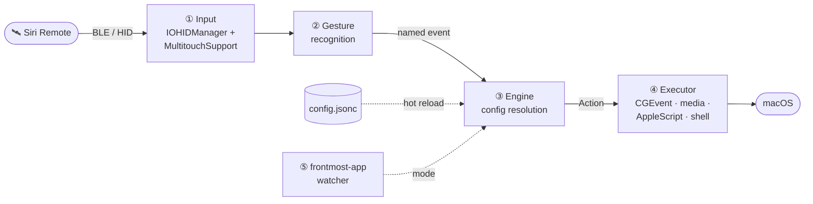
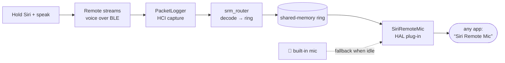

<div align="center">


# 🎛️ Codex Siri Remote

### Control Codex Desktop with a third-generation Apple Siri Remote.

[](LICENSE)
&nbsp;
&nbsp;
&nbsp;
&nbsp;

*An open-source, Track-A-first controller profile built on*
*[SiriRemoteForge](https://github.com/HOLODATA-COM/SiriRemoteForge).*

</div>

---

## 此 fork：简体中文界面、微信输入法与 Claude

本仓库在 [Codex Siri Remote](https://github.com/luobosibing2/codex-siri-remote) 基础上增加简体中文界面，并修复启动或普通鼠标移动导致应用意外抢占前台的问题。

推荐配置为 [`examples/wechat-claude.jsonc`](examples/wechat-claude.jsonc)：语音键按住左 Option 触发微信输入法，返回键依次切换 Codex → Chrome → Claude → Codex，TV 键单击发送 Return。自动聚焦默认关闭。详细构建、配置安装及权限恢复说明见 [`localization/README.md`](localization/README.md)。

下文 V1 键位表描述保留的原版 `examples/codex-remote-v1.jsonc`，其 Fn 语音键和双应用切换与上述推荐配置不同。

## ESP32 触屏 USB 键盘与麦克风（开发版）

新增独立硬件方案：Apple Siri Remote 通过蓝牙连接 Waveshare ESP32-S3-Touch-LCD-3.5，开发板通过 USB 数据线连接电脑，枚举为标准键盘和 **Siri Voice Pad Microphone** 麦克风。按键与音频直接经 USB 传输，不经过局域网；使用此方案不需要运行本仓库的 Mac 遥控器应用。

| 操作 | ESP32 触屏版行为 |
|---|---|
| 按住遥控器侧面语音键 | 保持 **右 Option**，使用遥控器麦克风；松开停止 |
| 遥控器圆盘中央确认键 | 回车 |
| 遥控器减号／加号键 | 左／右方向键 |
| 遥控器播放／暂停键 | 空格（按下保持、松开释放） |
| 遥控器圆环左键／屏幕 ChatGPT | 左 Ctrl＋左 Option＋左 Command＋G：唤起／隐藏 ChatGPT |
| 遥控器圆环右键／屏幕 Claude | 左 Ctrl＋左 Option＋左 Command＋C：唤起／隐藏 Claude |
| 遥控器小电视键／屏幕输入法 | Command＋空格：切换输入法 |
| 屏幕底部左右箭头 | 左右移动光标 |
| 屏幕大回车按钮 | 回车 |
| 点击屏幕麦克风 | 开启板载麦克风并保持右 Option；再点停止 |

蓝牙卡片显示连接状态，麦克风图标显示输入状态。遥控器语音优先于板载录音，松开后不会自动恢复板载录音。**这里的右 Option 与上面的 Mac 应用配置（左 Option）不同**，请在微信输入法中使用对应快捷键，并选择 USB 麦克风作为声音输入。

### 源码与当前状态

| 目录 | 内容与验证范围 |
|---|---|
| [esp32-siri-pad](esp32-siri-pad/README.md) | 当前 ESP-IDF 触屏固件：USB 键盘、UAC2 麦克风、板载 Opus 解码、双麦克风切换、中文触屏界面 |
| [esp32-siri-test](esp32-siri-test/README.md) | 早期 Arduino 蓝牙与麦克风串口验证程序，保留用于协议排查 |
| [siri-usb-bridge](siri-usb-bridge/README.md) | 树莓派 USB gadget 原型及固定版本蓝牙接收器；因供电问题暂停实机推进 |

截至 2026-09-15：Mac 识别键盘与麦克风，遥控器自动重连、真实遥控器收音及松开停止已验证；屏幕复位流程及 RGB565 字节顺序已修复，用户确认重插后显示正常。主机状态与快捷键逻辑 17 组测试通过。

当前仍是开发版：真实录音的蓝牙丢包、解码错误为零，但音频缓冲丢弃计数仍会增长；**不能把主动说话停顿判为断音，也尚未完成音频连续性验收**。电脑端按键接收、板载麦克风反复切换和微信输入法端到端操作仍待完整实测。详见 [验收记录](esp32-siri-pad/验收记录.md)。新布局固件采用 OFL 中文字体子集。应用高亮只表示最近由 Pad 发出的快捷键，不代表真实忙碌状态。

## Codex Remote V1：中文快速开始

这个分叉把第三代 Siri Remote 变成 Codex Desktop 的手持控制器。它优先采用
**轨道 A**：不修改 Codex，也不接入 app-server，而是通过 macOS 的鼠标、键盘、
Accessibility 和应用激活能力完成控制。未来的原生集成只复用
[`WorkflowIntentExecuting`](SiriRemoteCore/Sources/SiriRemoteCore/WorkflowIntentExecutor.swift#L31-L41)
这条语义接口。

### 买哪个型号

请购买 **第三代 Siri Remote，型号 A2854，USB-C 充电口，2022 年推出**。

- 机身底部应为 USB-C，而不是旧款 Lightning；
- 它具备触控圆盘、实体方向环、Siri、TV、返回、播放/暂停、音量和静音键；
- Apple 官方规格确认 A2854 使用 Bluetooth 5.0，并支持触控、轻点和圆周手势：
  [Siri Remote（第 3 代）技术规格](https://support.apple.com/en-ie/111844)；
- 本项目实机识别到的 Apple HID 标识为 Vendor ID `0x004C`、Product ID `0x0315`。

目前 V1 只把 A2854 作为验收型号。外观相近的旧款可能能够连接，但不属于本项目承诺的
测试范围。

首次安装请按这个顺序进行：
**连接 A2854 → 构建 `.app` → 安装 V1 配置 → 首次启动并授权 → 实机验收**。

### 当前键位

| 遥控器输入 | Codex 前台 | Chrome / 其他应用 |
|---|---|---|
| 触控圆盘 | 鼠标移动、轻触点击、圆周滚动 | 同左 |
| 方向环上 / 下 | 菜单和审批选项移动 | 普通上 / 下方向键 |
| 方向环左 / 右 | 返回 / 前进导航历史（`⌘-[` / `⌘-]`） | 普通左 / 右方向键 |
| 中心键 | 鼠标按下、点击和拖拽 | 鼠标按下、点击和拖拽 |
| TV / 显示器键单击 | Return：发送 | Return |
| TV / 显示器键双击 | 双 Escape，中断当前运行 | 双 Escape |
| `<` 返回键 | 在 Codex 与 Chrome 之间切换 | 切换回 Codex |
| Play/Pause | `⌘-B`：显示或隐藏 Codex 边栏 | 保留系统媒体播放 / 暂停 |
| 按住 Siri | 聚焦当前任务最底部输入框，等待 120 ms，再按住 Fn；松开释放 Fn | 直接按住 / 释放 Fn |
| 音量、静音、Power | 不接管，保留系统行为 | 不接管，保留系统行为 |

Siri 键调用的是当前输入法对 Fn 的响应；本机方案使用豆包输入法和 Mac 麦克风。V1
不会启用遥控器麦克风，也不会把 Fn 绑定到 Codex 自带的全局听写。

### 1. 把遥控器连接到 Mac

1. 先通过 USB-C 给遥控器充电。
2. 打开 Mac 的 **系统设置 → 蓝牙**。
3. 将遥控器贴近 Mac，同时按住 **`<` 返回键 + 音量加键**约 5 秒，使它进入配对状态。
4. 在“附近的设备”中找到 `siriremote` 或 Siri Remote，点击“连接”。
5. 如果遥控器仍被 Apple TV 抢占，先让它远离 Apple TV；也可以按住
   **TV / 控制中心键 + 音量减键**约 5 秒重启遥控器，再重复配对。

配对和重启组合键来自
[Apple 官方的 Siri Remote 重新连接说明](https://support.apple.com/en-gb/102569)；
官方页面以 Apple TV 为连接目标，在第 4 步改为从 Mac 蓝牙设置完成连接即可。

连接后可在终端确认：

```sh
system_profiler SPBluetoothDataType | sed -n '/siriremote:/,/Services:/p'
```

输出中应看到 `Connected: Yes`，A2854 通常还会显示 Vendor ID `0x004C` 和 Product ID
`0x0315`。如果你的设备名称不是 `siriremote`，把命令中的名称换成蓝牙设置里显示的名称。

### 2. 从源码构建和部署

要求：

- Apple Silicon 或 Intel Mac，macOS 13 或更高版本；当前 Codex V1 实机验证环境为
  Apple Silicon；
- Xcode Command Line Tools，可用 `xcode-select --install` 安装；
- 已按上一节通过系统蓝牙连接 A2854。

克隆公开仓库后运行：

```sh
git clone https://github.com/alfred-bot-001/codex-siri-remote.git
cd codex-siri-remote/app
./build.sh
./create_app_bundle.sh
```

`build.sh` 生成命令行可执行文件 `app/HyperVibe`；
`create_app_bundle.sh` 生成菜单栏应用 `app/HyperVibe.app` 并附带 GPL 许可证与 NOTICE。
应用默认不会出现在 Dock；启动后从菜单栏图标打开设置或退出。

本地如果没有 `siriRemote Local Signing` 证书，脚本会使用 ad-hoc 签名。这适合源码部署，
但每次重新生成 `.app` 后签名身份可能变化，macOS 可能要求重新授权。

### 3. 安装 Codex V1 配置

在仓库根目录运行：

```sh
mkdir -p ~/.config/siriremote
cp examples/codex-remote-v1.jsonc ~/.config/siriremote/config.jsonc
```

配置文件 [`examples/codex-remote-v1.jsonc`](examples/codex-remote-v1.jsonc) 是本项目的
推荐布局。运行中的应用会热重载 `~/.config/siriremote/config.jsonc`，修改后通常无需重启。
应用不会修改 `~/.codex/keybindings.json`。

### 4. 授予 macOS 权限

先在仓库根目录首次启动应用：

```sh
open app/HyperVibe.app
```

随后打开 **系统设置 → 隐私与安全性**，将刚生成的 `HyperVibe.app` 加入并启用：

- **辅助功能（Accessibility）**：移动鼠标、发送快捷键、聚焦 Codex 输入框；
- **输入监控（Input Monitoring）**：读取遥控器实体按键和 HID 事件；
- 系统首次询问时允许蓝牙访问。

授权后完全退出并重新打开应用：

```sh
pkill -x HyperVibe || true
open app/HyperVibe.app
```

如果重新构建 `.app` 后，设置中虽然仍显示已开启，但按键突然无响应，可以重置旧授权，
再把当前 `app/HyperVibe.app` 重新加入两个列表：

```sh
tccutil reset Accessibility com.hypervibe.app
tccutil reset ListenEvent com.hypervibe.app
```

这会删除该 bundle ID 的旧授权，下一次启动必须重新确认；正常升级时不要反复执行。

### 5. 验证安装

先打开运行日志：

```sh
tail -f /tmp/hypervibe.log
```

正常启动应能看到 Input Monitoring 已授权、event tap 已安装、A2854 被识别，以及前台
应用命中的 profile。随后依次验证：

1. 触控圆盘移动鼠标，轻触点击，沿外圈滑动滚动；
2. Codex 中上 / 下选择菜单，左 / 右返回和前进；
3. 中心键点击或拖拽，TV 单击发送，TV 双击中断；
4. `<` 键在 Codex 与 Chrome 之间切换；
5. Play/Pause 连按两次，确认 Codex 边栏关闭后恢复；
6. 在焦点不位于输入框时第一次按住 Siri，确认它直接聚焦最底部输入框并启动豆包，
   松开后停止且没有 Fn 粘键。

开发者还应运行当前软件验收：

```sh
./tests/run-software-verification.sh
(cd app && ./build.sh)
git diff --check
```

软件测试只能验证事件顺序、配置路由和可构建性，不能替代 A2854 与豆包输入法的真实
联合验收。完整的决策、证据与剩余边界以 [`DECISIONS.md`](DECISIONS.md) 为准。

### 已知边界

- 项目使用私有 `MultitouchSupport` 框架；macOS 升级可能影响触控圆盘。
- Codex 的 Accessibility 结构或快捷键升级后，需重新验证底部输入框、`⌘-B`、双 Escape
  中断以及返回 / 前进。
- 当前布局没有专用的单 Escape 拒绝键；审批时请用触控点击拒绝。审批界面误双击 TV
  可能让两个 Escape 作用于不同状态。
- 当前 Command Line Tools 环境缺少 XCTest，因此上游 `swift test` 未被列为已通过；
  新增工作流逻辑由 [`tests/run-software-verification.sh`](tests/run-software-verification.sh)
  覆盖。安装完整 Xcode 后仍建议补跑 `swift test`。
- 不要运行麦克风、LaunchDaemon、PacketLogger 或 Power 键安装流程；它们不属于 Codex
  Remote V1。

### 开源来源与许可证

本项目保留 [SiriRemoteForge](https://github.com/HOLODATA-COM/SiriRemoteForge) 的 Git
历史，并基于上游提交
[`10581a960f0738e36516defb79db24b18df214d3`](https://github.com/HOLODATA-COM/SiriRemoteForge/commit/10581a960f0738e36516defb79db24b18df214d3)
开发。代码继续采用 [GPL-3.0-or-later](LICENSE)，二进制分发必须一并保留
[NOTICE](NOTICE)、许可证和对应源码。私有 macOS 框架意味着它不适合 App Store 或沙盒分发。

---

> **TL;DR** — Remap every button, the click-ring, the trackpad, and swipes to any action; make one
> key mean six things; swap the whole remote with layers; drive the cursor from the glass; and
> reconfigure the entire device by editing **one hot-reloading file**. No settings screen required.

```jsonc
// Back button: tap deletes, hold half a second closes the window,
// hold a bit longer quits the app. Each delay is set independently.
"button.menu":       { "action": "keystroke", "keys": "delete" },
"button.menu.hold":  { "action": "closeWindow", "after": 0.5 },
"button.menu.hold2": { "action": "applescript", "after": 1.2, "script": "…" },

// …but in a browser, "back" means back.
"browser": {
  "button.menu": { "action": "keystroke", "keys": "cmd+[" }
}
```

Save the file and it takes effect. No restart, no reconnect, no settings screen to click through —
which also means an agent or a script can reconfigure the whole device by editing one file.

**What you get**

- Every input is remappable: buttons, the click-ring, the trackpad, swipes, two-finger tap.
- A key can mean up to six things — tap, double-tap, triple-tap, and up to three long-press
  stages, each with its own delay. An on-screen card shows what you'll get if you let go now, and holding past the
  last stage cancels.
- Per-app profiles that fall through an inheritance chain, plus **layers** that swap the whole
  remote at once (momentary while held, or sticky).
- The glass drives the cursor with tunable acceleration, iPod-style circular scroll, sticky drag,
  shake-to-find, and press-to-click.
- A radial app launcher, animated Space switching, window controls, brightness, and a native
  settings app with a drawn, clickable remote.

> **Scope.** macOS only, and it uses private frameworks (MultitouchSupport, SkyLight) to reach the
> trackpad and Spaces — so it is not sandboxed and can never ship on the App Store. Build it
> yourself or use a beta GitHub Release when available. Release builds are ad-hoc signed, not
> Apple-notarized, and need a one-time right-click → Open. This is a power tool, and it asks for the
> permissions it needs: Accessibility and Input Monitoring.

---

## Codex Remote V1 profile

This fork adds a Track-A workflow action that stays independent of Codex internals. Copy
[`examples/codex-remote-v1.jsonc`](examples/codex-remote-v1.jsonc) to
`~/.config/siriremote/config.jsonc` to use the agreed A2854 layout:

- click-ring: Up/Down navigate normally; in Codex, Left/Right send navigation-history
  Back/Forward (`⌘-[` / `⌘-]`), while other apps retain arrow keys; touch surface: upstream
  cursor, tap-to-click, and circular scroll;
- Center: upstream mouse click/drag in every app, including Codex;
- TV: single-tap Return/send, double-tap interrupt with two Escapes 200 ms apart;
  Back (`<`): Codex/Chrome toggle; in Codex, Play/Pause sends `⌘-B` to toggle the sidebar,
  while other apps retain native media behavior;
- hold Siri: in Codex, focus the current window's bottom composer, allow 120 ms for focus to
  settle, then produce real Fn-down/Fn-up; other apps keep the immediate Fn hold behavior.

Volume and Mute are unbound so their native system behavior remains. Power is intentionally
unbound. This V1 does not start the remote/virtual microphone path, modify Codex, connect to
app-server, or edit `~/.codex/keybindings.json`. The full decision record and accepted approval
mis-press risk are in [`DECISIONS.md`](DECISIONS.md).

Software tests cannot prove that Doubao accepts a synthetic Fn event or that A2854 HID/touch input
matches the simulated phases. Report software verification and A2854 hardware verification
separately.

Codex's shortcut page opens with `⌘-/`; commands such as submit, model/project selection, panels,
and task navigation can be assigned there. The currently verified Codex Desktop build does not
register configurable stop/interrupt/retry commands, so Play/Pause deliberately uses the
two-Escape workflow instead. Do not bind Codex `globalDictationHold` (or another global Codex
dictation command) to Fn: Fn belongs to the active input method in this profile. Any future
remote-specific Codex hotkey must be recorded in [`DECISIONS.md`](DECISIONS.md) before changing the
profile.

---

## What it does

- **Everything is remappable.** Buttons (Back/Menu, TV, Siri, Play/Pause, Mute, Volume ±, Power),
  the click-ring (up/down/left/right + center), one-finger swipes, and two-finger tap — each maps
  to any action.
- **Trackpad → cursor.** The remote's glass trackpad drives the mouse pointer with tunable speed,
  a steadiness dead-zone, velocity-based pointer acceleration, press-to-click freeze, tap-to-click,
  and iPod-style **circular scroll** (circle a finger on the outer ring to scroll).
- **Per-app profiles.** The frontmost app selects a *mode* (e.g. a browser mode, a terminal mode);
  bindings fall through a `inherits` chain to a global default, then to the remote's native behavior.
- **Layers.** A key can toggle a **layer** (like a keyboard layer): tap it to switch a sticky layer
  on/off, or hold it for a momentary layer. Layers **compose with the app** — the same layer can do
  different things in different apps. An on-screen HUD confirms the switch.
- **Multi-stage long-press** (`.hold` / `.hold2` / `.hold3`, release-to-select), **multi-tap**
  (`.double` / `.triple`), and **hold-to-repeat** (auto-repeats a keystroke while held).
- **Extras:** power button dims all displays *instead of sleeping or locking the Mac* (macOS's own
  power-button hotkey is suppressed for the remote only — your Mac's physical power button is
  untouched), and any touch restores them; a HUD confirms the remote connecting and disconnecting;
  shake the cursor to flash a "find my pointer" highlight; animated macOS **Spaces** switching.
- **Two ways to configure:** hand-edit `~/.config/siriremote/config.jsonc` (hot-reloads on save), or
  use the built-in **Settings** app — a Tuning tab (sliders) and a Layout tab (a drawn remote + an
  inline, click-to-edit mapping editor with per-app layers).

---

## How it works



The shipping app has two Swift halves, plus a self-contained virtual-microphone subsystem and an
older DriverKit experiment:

- **`SiriRemoteCore/`** — a pure-Swift, dependency-free, unit-tested engine (a SwiftPM package). It
  owns the config model (JSONC parsing, the `Action` enum, per-app modes + `inherits` resolution,
  layers, multi-stage hold thresholds), the config **write-back** (serialize a `Config` back to
  JSONC so a UI edit round-trips), and the circular-scroll math. No AppKit, no I/O — trivially
  testable (`swift test`).
- **`app/`** — the native macOS layer built with `swiftc` (see `app/build.sh`). It seizes the remote
  over HID (`IOHIDManager`), reads the trackpad via the private `MultitouchSupport` framework,
  recognizes gestures, watches the frontmost app, and executes actions with CGEvent / media-key /
  AppleScript / shell. It also hosts the SwiftUI **Settings** window. The core package is compiled
  straight into this binary (no separate library).
- **`mic/`** — the working **virtual microphone**: a CoreAudio HAL plug-in that publishes a
  "Siri Remote Mic" input device, fed by a Bluetooth-voice router and an on-demand root daemon.
  See [🎙️ Turn the remote into a microphone](#microphone).
- **`driverkit/`** — an earlier HIDDriverKit microphone-replacement proof of concept (superseded by
  `mic/`; kept for reference). Build/sign scripts do not install or activate it.

---

## Requirements

- macOS 13+ (Ventura or later), Apple silicon or Intel.
- A **3rd-generation Siri Remote** (2022, USB-C). Pair it over Bluetooth first (hold it near the Mac;
  it appears as a keyboard/trackpad device).
- Xcode command-line tools (`xcode-select --install`) for `swiftc`.

**No third-party tools.** Animated Space switching was once routed through BetterTouchTool; it now
goes through System Events, which needs Automation permission (macOS asks once) — see the `space`
action.

---

## Install a beta build

Published beta builds on the
[Releases page](https://github.com/HOLODATA-COM/SiriRemoteForge/releases) provide two Apple-silicon
downloads:

- **App only** — unzip `HyperVibe-…-macOS-arm64.zip`, move `HyperVibe.app` to Applications, then
  right-click → **Open** once.
- **Full Setup (advanced)** — adds the Siri Remote Mic system components and
  `HyperVibe Uninstall.app`. It asks for an administrator password, briefly restarts system audio,
  and runs a 25-second `coreaudiod` safety check with automatic plug-in rollback.

Both require macOS 13+ and are currently arm64-only. Source builds can still be made locally. The
beta archives are ad-hoc signed rather than Apple-notarized because the hardened runtime terminates
the private MultitouchSupport callback used by the remote trackpad.

---

## Build & run

```sh
cd app
./build.sh              # compiles the app + SiriRemoteCore into ./HyperVibe
./create_app_bundle.sh  # wraps it into HyperVibe.app (icon auto-generated, code-signed)
open HyperVibe.app
```

`build.sh` produces a bare `./HyperVibe` you can also run directly (`./HyperVibe --settings` opens
the settings window on launch). `create_app_bundle.sh` packages a double-clickable `HyperVibe.app`.

**It's a menu-bar app** (no Dock icon): after launching, click the walkie-talkie icon in the menu bar
for **Settings… / Quit**. If the menu-bar icon is hidden (e.g. behind the notch), just **double-click
`HyperVibe.app` again** — that reopens the Settings window.

### Permissions

macOS gates the low-level access this app needs. On first run, grant it in
**System Settings → Privacy & Security**:

- **Accessibility** — to move the cursor and post keystrokes.
- **Input Monitoring** — to receive the remote's buttons over HID. If the buttons don't respond,
  this is almost always why (the log shows `IOHIDManagerOpen failed 0xE00002E2`).

The bundle is signed **without** the hardened runtime on purpose — under the hardened runtime the
private MultitouchSupport touch callback trips code-signing enforcement and the app is killed the
instant you touch the trackpad. `create_app_bundle.sh` prefers a stable local self-signed identity
(`siriRemote Local Signing`) if present, so permissions survive rebuilds; otherwise it ad-hoc signs.

### Required system setting if you bind the Power button

**Only needed if you map `button.power`.** Skip this otherwise.

macOS translates the remote's Power button into the *system* power-button hotkey. `loginwindow`
acts on that (`PBSleepsMachine`) and sleeps/locks the Mac — **in addition to** running whatever you
bound, so a Power binding would dim your screen *and* lock it. Turn that behaviour off:

```sh
sudo defaults write /Library/Preferences/com.apple.loginwindow PowerButtonSleepsSystem -bool false
```

It takes effect immediately (loginwindow re-reads the pref on every press). To undo, write `true`.

**What this changes:** your Mac's own physical power button no longer sleeps the machine on a short
press. Touch ID, holding it for the force-shutdown dialog, closing the lid, and the Apple menu's
Sleep all keep working.

**Getting sleep back on the remote** — bind a long press, which the app *can* control:

```jsonc
"button.power":      { "action": "brightness", "value": 0.0 },          // tap → dim
"button.power.hold": { "action": "shell", "command": "pmset sleepnow" } // hold ≥ holdThreshold → sleep
```

> **Why not just intercept the event?** It was tried thoroughly and it cannot work. Measured
> directly: with a `CGEventTap` consuming **all 33** of the power events it saw, and with all seven
> of the remote's HID interfaces seized, `loginwindow` still received the button and slept the Mac.
> It reaches loginwindow by a path userspace cannot intercept, so the preference above is the only
> real lever. Short presses *appeared* to work only because loginwindow debounces them at 350 ms —
> which is also why long presses failed every time.

Pressing Power also opens a **1-second input guard**: the button sits right next to the glass, so
the press almost always brushes the trackpad, which used to instantly undo the dim it had just
triggered. During the guard, touches and other buttons are still read but do not fire actions.

---

<a id="microphone"></a>

## 🎙️ Turn the remote into a microphone

The 3rd-gen Siri Remote has a genuinely good close-talk microphone — the one you'd hold up and speak
into. macOS never exposes it (it isn't a standard Bluetooth audio device), so `mic/` builds one: a
CoreAudio device named **"Siri Remote Mic"** that any app can select.

**Hold the Siri button and speak → your voice arrives from the remote's close mic. Let go → it
seamlessly falls back to the Mac's built-in mic.** Pair that with a push-to-talk binding and it's a
dictation setup where the mic is always in your hand.



Under the hood: an on-demand **root LaunchDaemon** (`mic/captured/`) runs Apple's PacketLogger only
while some app is actually using the device; **`srm_router`** (`mic/router/`) decodes the remote's
proprietary BLE voice notifications into a lock-free shared-memory ring; and a **HAL plug-in**
(`mic/driver/`, a hardened fork of [BlackHole](https://github.com/ExistentialAudio/BlackHole))
serves that ring — or the built-in-mic fallback ring — to CoreAudio, crossfading on every hand-over.

> [!IMPORTANT]
> **This half is power-user territory and has real caveats:**
> - It requires Apple's **PacketLogger** (free, in [*Additional Tools for Xcode*](https://developer.apple.com/download/all/?q=Additional+Tools+for+Xcode)) at `/Applications/PacketLogger.app` — it is **not** bundled.
> - It installs a HAL plug-in into `coreaudiod` and a root daemon. When PacketLogger is available,
>   the daemon enables Bluetooth HCI debug traces for capture; without PacketLogger it leaves those
>   traces unchanged. This is a system-level feature; read `mic/README.md` first.
> - It works by **interoperating with Apple's undocumented remote-voice protocol** (reverse-engineered). It's a research/interop feature, is fragile across macOS versions, and carries a small (~1–2 s) switch latency.

The advanced Full Setup Release asset installs the complete stack behind a watchdog and adds a
dedicated uninstaller. Development setup and component-level details live in
[`mic/README.md`](mic/README.md); release packaging lives in [`dist/`](dist/README.md).

---

## Configuration — `~/.config/siriremote/config.jsonc`

JSONC (JSON + `//` comments). A default is written on first run. **Saving hot-reloads it live.**
Three top-level keys: `settings`, `appProfiles`, `modes`. A complete, working example to crib from
lives in [`examples/config.jsonc`](examples/config.jsonc), and the maintainer's actual daily-driver
setup — push-to-talk, per-app Music/browser/terminal modes, layers — is in
[`examples/config.author.jsonc`](examples/config.author.jsonc).

```jsonc
{
  "settings": { "defaultMode": "global", "cursorSpeed": 1.4, /* … tuning … */ },

  // Frontmost app's bundle id → mode name (plus a "default").
  "appProfiles": {
    "com.google.Chrome": "browser",
    "dev.warp.Warp-Stable": "terminal",
    "default": "global"
  },

  "modes": {
    "global": {
      "button.tv":  { "action": "layer", "to": "L1" },          // TV button = layer L1
      "ring.left":  { "action": "keystroke", "keys": "left" },
      "ring.up.hold": { "action": "shell", "command": "open -a 'Mission Control'" }
    },
    "browser": {                                                 // inherits global, overrides some keys
      "inherits": "global",
      "button.menu": { "action": "keystroke", "keys": "cmd+[" }, // Back button = history back
      "L1.ring.left":  { "action": "keystroke", "keys": "cmd+opt+left" }  // L1 in Chrome = prev tab
    },
    "L1": { "inherits": "global" }                               // layer marker (see Layers)
  }
}
```

### Event keys

`ring.up` `ring.down` `ring.left` `ring.right` · `select` (center click) · `touch` (surface) ·
`swipe.up` `swipe.down` `swipe.left` `swipe.right` · `tap.two` ·
`button.menu` (the Back ‹ button) `button.tv` `button.siri` `button.playPause`
`button.volumeUp` `button.volumeDown` `button.mute` `button.power`.

Suffix any button/ring key with:

- **`.double` / `.triple`** — multi-tap variants (`button.siri.double`, `ring.up.triple`). Taps are
  counted inside `doubleTapWindow`, and only the deepest count reached fires — a triple never also
  emits a double or a single.

  Each key waits exactly as long as its own bindings require, and no longer. A key with no
  multi-tap binding fires its tap on the press, with no added latency at all. Adding `.double` makes
  the double fire immediately on the second press. Adding `.triple` is the only thing that costs
  anything: that key's *double* must now wait one `doubleTapWindow` to see whether a third tap is
  coming. No other key is affected, and the plain tap is never delayed by either.
- **`.hold` / `.hold2` / `.hold3`** — multi-stage long-press (`ring.up.hold`). *Release-to-select:*
  keep holding to reach a deeper stage; the deepest stage reached fires when you let go.

### Actions

| `action`      | params                                | notes |
|---------------|---------------------------------------|-------|
| `keystroke`   | `keys` e.g. `"cmd+shift+["`            | modifiers cmd/ctrl/opt/shift/fn (+ `l`/`r` variants like `rcmd`); a modifier-only string is a held hyperkey chord; keys: letters, digits, arrows, esc/enter/space/tab, punctuation |
| `workflow`    | `intent`                              | `primary`, `cancel`, `interrupt`, `dictationHold`, or `toggleCodexChrome`; semantic seam used by Codex Remote V1 |
| `media`       | `key`                                 | playpause/next/previous/volup/voldown/mute |
| `mouse`       | `op`                                  | click/rightclick/move/scroll |
| `launch`      | `app` and/or `url`                    | open an app or a URL |
| `shell`       | `command`                             | runs via `/bin/zsh -c` — the escape hatch |
| `applescript` | `script`                             | e.g. control Apple Music |
| `mode`        | `to`                                  | switch the active mode |
| `layer`       | `to`                                  | make this key a **layer** key (see below) |
| `space`       | `to`: `left`/`right`                  | switch macOS Spaces, animated, via System Events (needs Automation permission) |
| `fullscreen`  | —                                     | toggle the frontmost window's full screen, via the Accessibility API — synthesizing Ctrl+Cmd+F does not work |
| `minimize`    | —                                     | minimise the frontmost window (Accessibility API) |
| `closeWindow` | —                                     | press the window's red close button. NOT Cmd+W, which closes a *tab* in anything tabbed |
| `appWheel`    | —                                     | summon the radial launcher (`settings.appWheel`) |
| `repeatKey`   | `keys`, `delay?`, `interval?`         | auto-repeat while held (the remote sends no auto-repeat) |
| `brightness`  | `value` (0…1)                         | set all displays' backlight; `0` = min (used by Power to dim) |

### Layers (layer × app)

Bind a key to `{ "action": "layer", "to": "L1" }`. That key becomes a **layer key**:

- **Tap** it → toggle layer `L1` *sticky* on/off (persists until tapped again).
- **Hold** it and press other keys → *momentary* `L1` (active only while held).

**A layer is a modifier, not a second keyboard.** Holding one never turns a bound key into a dead
key: a key the layer says nothing about keeps doing whatever it does unlayered, *in the current app*.

While layer `L` is held, key `K` resolves most-specific-first:

| # | Lookup | Means |
|---|--------|-------|
| 1 | `"L.K"` in the active app mode's `inherits` chain | this app, in this layer |
| 2 | `"K"` among mode `L`'s **own** bindings | any app, in this layer |
| 3 | `"K"` in the active app mode's `inherits` chain | this app, **without** the layer |

Example: `L1.ring.left` = `cmd+shift+left` in `global` (the default) but `cmd+opt+left` in `browser`
(step 1); `terminal` binds `button.menu` to `repeatKey delete` and says nothing about it in `L1`, so
holding `L1` in a terminal still deletes (step 3).

A layer claims a button **whole**. Bind any variant — `L1.button.playPause`, or just its `.hold` —
and every other variant of that button resolves inside the layer only; the unlayered `.hold2` no
longer shows through underneath. A button is one thing, even though its variants live under separate
keys, and the alternative is writing explicit do-nothing bindings for each. A button the layer binds
no variant of still falls through entirely.

Two consequences worth knowing:

- **There is no fourth step for "any app, without the layer."** Steps 1 and 3 walk the *app* mode's
  `inherits` chain, and that is what reaches `global` — a key bound only in `global`'s base still
  resolves under a layer inside `terminal`, because `terminal` inherits `global`. Keeping this in
  `inherits` instead of hard-wiring a global fallback is what lets a mode opt out: a mode written
  without `inherits` is standalone and genuinely sees nothing else, layered or not. The flip side is
  that an app mode that forgets `"inherits": "global"` will only answer for the keys it lists.
- **Step 2 does not follow mode `L`'s own `inherits`.** Layer modes are written as
  `"L1": { "inherits": "global" }`, so following it would answer with `global`'s *base* binding and
  shadow step 3's app-specific one. Put app-agnostic layer bindings directly in the `L1` mode; they
  are step 2. Keep the marker mode so the layer exists.

### Labels and icons

Any binding may carry `label` and `icon`. They change nothing about what runs — they are how the
hold-progress HUD names the action you'd get by releasing right now.

```jsonc
"button.power.hold": { "action": "shell", "command": "pmset sleepnow",
                       "label": "Sleep", "icon": "moon.fill" },
```

`icon` is an SF Symbol name, and is usually unnecessary: an action that **opens** an app shows that
app's real icon *instead of* a label (`launch`, and `shell` commands written as `open -a "Some App"`),
and an action **aimed at** an app (`applescript` containing `tell application "X"`) shows that app's
icon *beside* its label. Otherwise a symbol is picked from the action kind.

**Presentation inherits down the mode chain on its own, field by field, independently of the
binding.** A key keeps its identity even where a mode re-binds it, so set `label`/`icon` once in
`global` and an app mode that overrides only the *action* still shows the same name and icon — no
duplication to drift out of sync. A mode that genuinely presents a key differently just says so, and
the nearer mode wins.

### Hold timing

Stages fire at `holdThreshold` / `holdThreshold2` / `holdThreshold3`, but any binding may set its
own with **`after`**:

```jsonc
"button.menu.hold":  { "action": "closeWindow", "after": 0.5 },
"button.menu.hold2": { "action": "applescript", "after": 1.2, "script": "…" },
```

The globals are shared by every key, so without this, tuning one button moved every other button
bound to the same stage — which twice forced a binding onto a stage it did not belong on purely to
leave another key's timing alone. **Stages are ordered by their effective delay, not by the suffix**,
so `.hold3` may perfectly well fire before `.hold`; the suffix is only a name.

`holdCancelGrace` is measured from the deepest stage that key actually binds, so a key whose deepest
hold is 0.5s does not sit through seconds of dead zone waiting to cancel.

### Focus follows remote cursor (apps that fill a display)

`"focusFollowsCursor": true` allows a fresh cursor movement emitted by the remote to
focus the app under the pointer after it rests for approximately 0.15 seconds. Startup,
ordinary mouse movement, and old remote positions cannot arm a focus request. Each movement
can produce only one request; dragging, mouse takeover, expired input, or a foreground-app
change while waiting cancels it.

The candidate app must already visibly cover at least 90% of the display. Coverage excludes
gaps and areas covered by other apps, and counts overlapping windows only once. If macOS
refuses normal activation, HyperVibe does not force the app to the front through Accessibility.

Off by default. Enabling it can still raise the target app and changes where keyboard input goes.

### App wheel (radial launcher)

`"appWheel": ["WeChat", "Google Chrome", "Music", "Warp"]` lists the apps, clockwise from the top;
empty disables it. Bind `{ "action": "appWheel" }` to a hold — typically the layer key's:

```jsonc
"button.tv":      { "action": "layer", "to": "L1" },
"button.tv.hold": { "action": "appWheel" },
```

It is an ordinary hold binding, so it gets the progress card and the cancel grace like any other,
and a layer key that carries hold stages still taps to toggle and still works as a momentary layer
when another key is pressed during the hold.

The wheel opens **centred on the pointer**, so choosing is a short flick outward rather than a trip
across the display — which matters on a 27 mm pad. Selection follows the CURSOR, not the finger's
position on the pad, so the trackpad behaves exactly as it always does. **Select** launches what is
highlighted; **any other button** cancels; nothing is highlighted while the pointer is in the middle
dead zone, so summoning it and pressing Select does nothing by accident.

### Settings (tuning)

All live in `settings` and in the app's **Tuning** tab: `cursorSpeed`, `cursorDeadzone`, pointer-accel
curve (`accelMin`/`accelMax`/`accelLowSpeed`/`accelHighSpeed`), `clickRiseThreshold`, `pressMoveMax`,
`holdThreshold`/`holdThreshold2`/`holdThreshold3`, `doubleTapWindow`, `spacesModeWindow`,
`findCursorEnabled`, `focusFollowsCursor`, and `circularScroll { enabled, minRadius, startThreshold,
pixelsPerRadian, scrollEase, invert }`. Config is the single source of truth — Tuning-tab slider changes are written
back to `config.jsonc` (debounced).

---

## The Settings app

- **Device** — live status for the paired remote: **battery %**, firmware revision, Bluetooth
  address, serial, vendor/product, and an expandable map of the seven HID interfaces macOS exposes.
  Battery also appears in the window header pill (`● Connected · 🔋 100%`) and turns orange/red as it
  drops. Battery/firmware come from the system Bluetooth stack (`system_profiler`, ~0.15 s, polled
  off the main thread); the interface map comes straight from `IOHIDManager`.
- **Tuning** — grouped sliders for cursor feel, acceleration, click, circular scroll, and button
  timing, each applying live. Ends with **Startup → Start at login**, which registers the app with
  `SMAppService` (macOS 13+). Registration is by bundle, so it follows `HyperVibe.app` and survives
  rebuilds in place; it also appears under **System Settings → General → Login Items**, so it can be
  turned off there even when the app isn't running. The toggle always re-reads the real
  registration, so it can't sit in a position macOS didn't accept — if macOS wants approval, the
  footer says so. Scriptable with `open HyperVibe.app --args --enable-login-item` (or
  `--disable-login-item`).
- **Layout** — "what every button does": a drawn aluminum remote on the left (click a button to jump
  to its mapping; the selected input stays highlighted), an **app hub** to pick the mode, an
  **Editing: base / layer** selector (the layer × app grid), and a grouped input→action list with
  Custom / Inherited / System tags. Click any input to open a docked editor for its
  Tap / Double-tap / Hold·· / Hold··· slots, written straight to `config.jsonc`.

---

## Repository layout

```
SiriRemoteForge/
├── SiriRemoteCore/        # pure engine (SwiftPM package) — config model, resolution, write-back, tests
│   ├── Sources/SiriRemoteCore/
│   └── Tests/SiriRemoteCoreTests/     # `swift test`  (config round-trip, resolution, layers, …)
├── app/                   # native macOS app (swiftc)
│   ├── *.swift            # HID, MultitouchSupport, gesture recog, executors, SwiftUI settings
│   ├── build.sh           # canonical build (compiles the app + ../SiriRemoteCore into one binary)
│   ├── create_app_bundle.sh
│   ├── tools/make_app_icon.swift
│   ├── SiriRemote-Bridging-Header.h / MultitouchSupport.h
│   └── HyperVibe.entitlements
├── mic/                   # virtual microphone (see the Microphone section)
│   ├── driver/            # CoreAudio HAL plug-in ("Siri Remote Mic"), a hardened BlackHole fork
│   ├── router/            # srm_router — decode BLE voice notifications → shared-memory ring
│   ├── captured/          # on-demand root LaunchDaemon (runs PacketLogger + router)
│   └── README.md
├── dist/                  # safe, versioned app-only + Full Setup Release packaging
└── driverkit/             # earlier Siri Remote microphone DEXT proof of concept (superseded by mic/)
    ├── SiriRemoteMicDriver.xcodeproj
    ├── Host/               # separate OSSystemExtensionRequest host
    ├── build-driver.sh    # unsigned DEXT build only
    └── build-host.sh      # embeds DEXT; does not launch or activate
```

The app target is named `HyperVibe` internally (historical, from the fork below); the product is
"siriRemote".

## Development

```sh
cd SiriRemoteCore && swift test     # unit tests for the engine
cd app && ./build.sh                # build the app
cd driverkit && ./build-host.sh     # build-only DEXT + host check
```

Debug logging goes to `/tmp/hypervibe.log` (HID events, device selection, executed actions).

The **working** microphone device is the `mic/` Bluetooth-router pipeline described
[above](#microphone). Getting
there meant ruling out the *in-band* approaches first; those dead ends and the full evidence log live
in [`docs/mic-reverse-engineering.md`](docs/mic-reverse-engineering.md).

The dead ends (all opt-in dev flags, absent from normal launch — kept for reference):

- `--dump-reports` — inventory IOHID reports and readable Feature values;
- `--activate-mic` — capture every remote interface and send the gen-3 `0xAF` input-enable byte;
- `--dump-gatt <remote-name>` — read-only CoreBluetooth inventory (blocked: macOS owns the connected
  HID service);
- `--native-ptt` — AppleBluetoothRemote's native `PushToTalk` property (returns `kIOReturnUnsupported`
  on the tested product `0x0315`);
- `--direct-ptt` — the driver's hidden Feature report `0x99` (the tested remote returns `kIOReturnError`).

An earlier native **DriverKit** proof of concept in [`driverkit/`](driverkit/README.md) builds and
development-signs, but a real host launch is killed by AMFI before `main` (`Code=-413`,
`No matching profile found`): a Personal development team cannot issue the required DriverKit HID
capabilities. It is superseded by `mic/` and kept only for reference.

Development invariant: a diagnostic instance temporarily replaces the normal app; it does not run
alongside it. After every diagnostic, stop the flagged process and restore exactly one no-argument
`HyperVibe.app` instance so remote control remains available.

## Hardware notes (3rd-gen Siri Remote)

- HID product `0x0315`, Apple BT vendor `0x004C`; the device name is the unit serial, so matching is
  by product id. The remote mirrors each logical button across several HID interfaces — duplicate
  callbacks are de-duplicated to a single state transition.
- The ring is a Consumer-page control (`0x42`–`0x45`); center = `0x80`. The Back (‹) button reports
  Generic-Desktop usage `0x86`, surfaced as **`button.menu`** (not `button.back`).
- The trackpad is read via `MultitouchSupport` (family 145, ~60 Hz over BLE); a press is detected by
  a sharp rise in contact size while the finger is still. No accelerometer/gyro on this generation.

## Contributing

Issues and pull requests are welcome — see [`CONTRIBUTING.md`](CONTRIBUTING.md). If you are picking
up Codex Remote work, use [`DECISIONS.md`](DECISIONS.md) for the accepted behavior, evidence,
superseded choices, and remaining hardware-verification boundaries.

## Credits & license

SiriRemoteForge is licensed under the **GNU General Public License v3.0 or later**. See
[`LICENSE`](LICENSE) for the full text.

It began as a fork of **hypervibe** (MIT, © 2026 Jinsoo An). Its native layer — HID device seizing,
the MultitouchSupport bridge, media-key synthesis, and the menu-bar scaffolding — was kept; the
hard-coded mappings were replaced by the config-driven engine here, and the gesture, layer, hold,
cursor, and settings layers were substantially rewritten.

The MIT License permits relicensing a derivative work under the GPL, but requires that the original
copyright notice be retained. It is reproduced in full in [`NOTICE`](NOTICE) and continues to apply
to the portions of this software that originate upstream.
